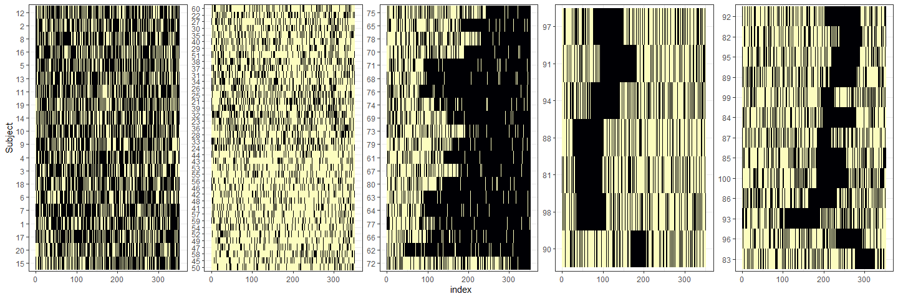

<!-- README.md is generated from README.Rmd. Please edit that file -->

# Binary Shape-Based Clustering

<!-- badges: start -->

<!-- badges: end -->

This repository accompanies “Shape-Based Clustering of Daily Weigh-In
Trajectories using Dynamic Time Warping” (doi). The aim of the paper was
to use Dynamic Time Warping, a shape-based clustering method, to cluster
binary trajectories and evaluate patterns. Study data is not made
publically available, however simulated data to resemble the study data
is used and shared in this repository.

  - Source files to load in data (data cleaning and simulation data)

<!-- end list -->

``` r
### Libraries 
library(tidyverse)
library(ggplot2)
library(dtwclust) # cluster time series with dynamic time warping
library(ecodist) # distance function for jaccard

### Source files
source("Code/01_CleanStudyData.R")
source("Code/02_SimulateClusters.R")
```

  - Plot the binary heatmap (this should be a file of its own to make
    heat maps based on the data)

<!-- end list -->

``` r
#### Function not incorporated yet
#### Sort by % adherence
source("Code/ClusterHeatmap.R")

ggplot(sim_plot, aes(x = day, y = participant_id, fill = weighed_in)) +
    geom_tile() + ggtitle("True Data Clusters and Mean Adherence %") + 
    theme(plot.title = element_text(hjust = 0.5)) + 
    scale_fill_viridis(discrete = TRUE, option="A") +
    facet_wrap(~cluster_assignment, scales = "free", ncol = 5)
```

<!-- -->

  - Cluster the data using Euclidean, Jaccard, and DTW and show how to
    use probability windows and linkages
      - Calculate distance

<!-- end list -->

``` r
### Using binary data
jac_dist <- distance(adherence_mat, method = 'jaccard')
dtw_dist <- dist(adherence_mat, method = 'dtw')
euc_dist <- distance(adherence_mat, method = 'euclidean')
```

``` r
### Using continuous data
source("Code/RollAvg.R")
roll_mat = roll_avg(adherence_mat, window = 14) # window size can be adjusted

jac_dist_roll <- distance(roll_mat, method = 'jaccard')
dtw_dist_roll <- dist(roll_mat, method = 'dtw')
euc_dist_roll <- distance(roll_mat, method = 'euclidean')
```

  - Cluster - specify linkage and number of clusters

<!-- end list -->

``` r
### Method can be specified as 'average', 'single', 'complete', or 'Ward'
### Provide the distance matrix you want to cluster
clust <- hclust(dtw_dist_roll, method = "average")

### Specify the number of clusters 
cut <- cutree(clust, k = 5)

### Visualize dendrogram
plot(clust)
rect.hclust(clust, k = 5, border = 2:6)
```

<!-- -->

  - Visualize clustering results

<!-- end list -->

``` r
### Add simulated clustering labels
hclus <- stats::cutree(clust, k = 5) %>% 
  as.data.frame(.) %>%
  dplyr::rename(.,cluster_group = .) %>%
  tibble::rownames_to_column("type_col")

hcdata <- ggdendro::dendro_data(clust)
names_order <- hcdata$labels$label

### Plot - plotting the binary data heat map based on the rolling average clustering
data.frame(t(adherence_mat[,-c(1:13)])) %>%
  dplyr::mutate(index = 1:352) %>%
  dplyr::rename_all(funs(stringr::str_replace_all(., "X", ""))) %>% 
  tidyr::gather(key = type_col,value = value, -index) %>%
  dplyr::full_join(., hclus, by = "type_col") %>% 
  mutate(type_col = factor(type_col, levels = as.character(names_order)), 
         weighed_in = factor(value, levels = 0:1, labels = c("no", "yes"))) %>% 
  ggplot(aes(x = index, y = type_col, fill = weighed_in)) +
  geom_tile() +
  scale_fill_viridis(discrete = TRUE, option="A") +
  facet_wrap(~cluster_group, ncol = 5, scales = "free") + 
  guides(fill=FALSE) + 
  theme_bw() + ylab("Subject") +
  theme(strip.background = element_blank(), strip.text = element_blank())
```

<!-- -->
