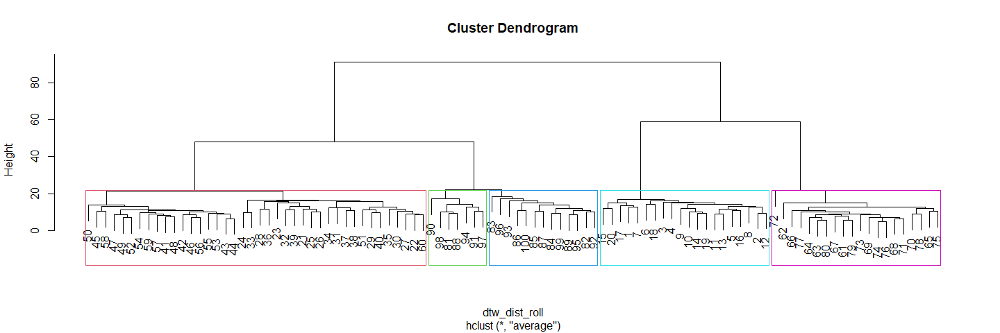

<!-- README.md is generated from README.Rmd. Please edit that file -->

# Binary Shape-Based Clustering

<!-- badges: start -->

<!-- badges: end -->

This repository is accompanies “Pattern-Based Clustering of Daily Weigh-In
Trajectories using Dynamic Time Warping” (DOI : [10.1111/biom.13773]). The aim of the paper was
to use Dynamic Time Warping, a shape-based clutering method, to cluster
binary trajectories and evaluate patterns. Study data is not made
publically available, however simulated data to resemble the study data
is used and shared in this repository.

We first load necessary libraries and source files that clean the study
data that is used to simulate clusters. The simulated dataset can be
accessed in the Data/DataSimulated folder.

``` r
### Libraries 
library(tidyverse)
library(ggplot2)
library(dtwclust) # cluster time series with dynamic time warping
library(ecodist) # distance function for jaccard
library(kableExtra)

### gtsummary package

### Source files
source("Code/01_CleanStudyData.R")
source("Code/02_SimulateClusters.R")
```

We plot the binary adherence of each participant stratified by their
true cluster assignment. In the plot below, black indicates a day in
which the participant did not weigh in while yellow indicates a day in
which the participant did weigh in. The plot is sorted by overall %
adherence, with lowest adherence on the bottom.

``` r
#### Sort by % adherence
source("Code/ClusterHeatmap.R")

ggplot(sim_plot, aes(x = day, y = participant_id, fill = weighed_in)) +
    geom_tile() + ggtitle("True Data Clusters and Mean Adherence %") + 
    theme(plot.title = element_text(hjust = 0.5)) + 
    scale_fill_viridis(discrete = TRUE, option="A") +
    facet_wrap(~cluster_assignment, scales = "free", ncol = 5)
```

<!-- -->

We use the Euclidan, Jaccard, and DTW distances in the paper to cluster
on our binary data and a rolling probability window of the binary data.

``` r
### Using binary data
jac_dist <- distance(adherence_mat, method = 'jaccard')
dtw_dist <- dist(adherence_mat, method = 'dtw')
euc_dist <- distance(adherence_mat, method = 'euclidean')
```

The RollAvg.R code file provides a `roll_avg` function that requires the
binary adherence matrix and a rolling window size. In this example we
calculate a 14-day rolling probability window.

``` r
### Using continuous data
source("Code/RollAvg.R")
roll_mat = roll_avg(adherence_mat, window = 14) # window size can be adjusted

jac_dist_roll <- distance(roll_mat, method = 'jaccard')
dtw_dist_roll <- dist(roll_mat, method = 'dtw')
euc_dist_roll <- distance(roll_mat, method = 'euclidean')
```

In the paper, we cluster under the average, single, complete, and Ward
linkages. In this example, we cluster using the average linkage with the
DTW distance using a 14-day rolling probability window. We define 5
clusters and the dendrogram below visualizes how the clusters are
determined.

``` r
### Method can be specified as 'average', 'single', 'complete', or 'Ward'
### Provide the distance matrix you want to cluster
clust <- hclust(dtw_dist_roll, method = "average")

### Specify the number of clusters 
cut <- cutree(clust, k = 5)

### Visualize dendrogram
plot(clust)
rect.hclust(clust, k = 5, border = 2:6)
```

<!-- -->

With our binary heatmap adherences, we can assess how well the
clustering algorithm worked.

``` r
### Add simulated clustering labels
hclus <- stats::cutree(clust, k = 5) %>% 
  as.data.frame(.) %>%
  dplyr::rename(.,cluster_group = .) %>%
  tibble::rownames_to_column("type_col")

hcdata <- ggdendro::dendro_data(clust)
names_order <- hcdata$labels$label

### Plot - plotting the binary data heat map based on the rolling average clustering
data.frame(t(adherence_mat[,-c(1:13)])) %>%
  dplyr::mutate(index = 1:352) %>%
  dplyr::rename_all(funs(stringr::str_replace_all(., "X", ""))) %>% 
  tidyr::gather(key = type_col,value = value, -index) %>%
  dplyr::full_join(., hclus, by = "type_col") %>% 
  mutate(type_col = factor(type_col, levels = as.character(names_order)), 
         weighed_in = factor(value, levels = 0:1, labels = c("no", "yes"))) %>% 
  ggplot(aes(x = index, y = type_col, fill = weighed_in)) +
  geom_tile() +
  scale_fill_viridis(discrete = TRUE, option="A") +
  facet_wrap(~cluster_group, ncol = 5, scales = "free") + 
  guides(fill=FALSE) + 
  theme_bw() + ylab("Subject") +
  theme(strip.background = element_blank(), strip.text = element_blank())
```

<!-- -->

It looks like the correct subjects were sorted into the correct
clusters. To verify, we can use external vailidation to assess if the
true cluster assignment matches the assigned one under dynamic time
warping. All of the listed indices are optimal if close to 1 except for
VI (or Variation of Information).

``` r
#### Source Validation Indices which will calculate validation indices based on user input
source('Code/ValidationIndices.R')

# Rename cluster labels for validation 
sim_clust$cluster_label <- ifelse(sim_clust$cluster_label == "low", 1, 
    ifelse(sim_clust$cluster_label == "dropout", 2, 
      ifelse(sim_clust$cluster_label == "vacation", 3, 
        ifelse(sim_clust$cluster_label == "med_adherence", 4, 5))))

# Provide true clusters for external validation
external_validation = validation(cut_matrix = cut, true_clusters = sim_clust$cluster_label)

kable(external_validation)
```

<table>

<thead>

<tr>

<th style="text-align:right;">

ARI

</th>

<th style="text-align:right;">

RI

</th>

<th style="text-align:right;">

J

</th>

<th style="text-align:right;">

FM

</th>

<th style="text-align:right;">

VI

</th>

</tr>

</thead>

<tbody>

<tr>

<td style="text-align:right;">

0.9526602

</td>

<td style="text-align:right;">

0.9816162

</td>

<td style="text-align:right;">

0.9325926

</td>

<td style="text-align:right;">

0.9657083

</td>

<td style="text-align:right;">

0.0562365

</td>

</tr>

</tbody>

</table>

If we do not know the true cluster assingment, we can use internal
validation indices instead. The Validation Indices pdf provides detail
about how each validation index is calculated.

``` r
# Provide original matrix and distance for internal validation
internal_validation = validation(matrix = roll_mat, distance = dtw_dist_roll, cut_matrix = cut)

kable(internal_validation)
```

<table>

<thead>

<tr>

<th style="text-align:right;">

Silhouette

</th>

<th style="text-align:right;">

Dunn

</th>

<th style="text-align:right;">

DaviesBouldin

</th>

<th style="text-align:right;">

Calinhara

</th>

</tr>

</thead>

<tbody>

<tr>

<td style="text-align:right;">

0.5918745

</td>

<td style="text-align:right;">

0.2641509

</td>

<td style="text-align:right;">

0.9151558

</td>

<td style="text-align:right;">

35.95916

</td>

</tr>

</tbody>

</table>
